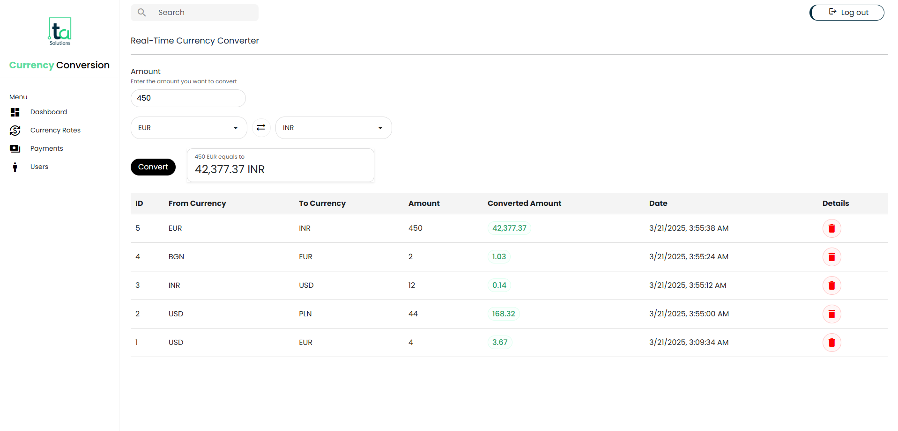

# TA-Assessment Currency Converter

Used: Angular 19v
Node: 22

the app is live on: https://app-three-dun.vercel.app

## Note:  
For the requirement **"This record should persist even if the website is reloaded,"** I have utilized **localStorage** because I was unsure whether using a database (Firebase/MongoDB) was permitted for this task.

## $To Run Angular on local: 
simply run npm i and then <b>npm start </b>

## To Start backend (api): </b> 
run npm i, and then run <b> npm build </b> and then <b> npm start </b>

Let me know if anything is not working or accessible

i have used modular approach in angular (component-based structure) by created shared components, services, models. and its responsive as well.

